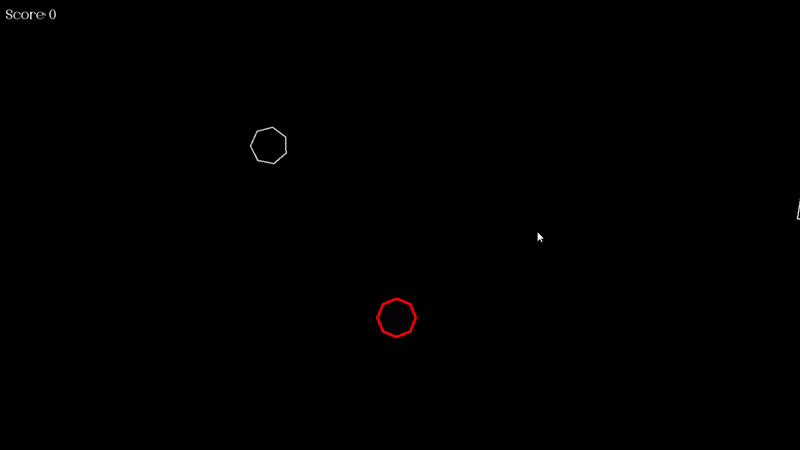

# ShapeWars

Arcade-style 2D shooter built with C++ and SFML, featuring ImGui-powered debugging tools. Pilot a geometric player, shoot toward the mouse, dodge and destroy enemies that split into smaller shapes, and tune gameplay via a simple config file.

- Languages: C++ (90.6%), C (8.3%), CMake (1.1%)
- License: MIT

## Demo


## Features

- Player movement with WASD, constrained to the window
- Aim-and-shoot with mouse
- "R" Button - special ability with cooldown
- Enemies spawn at intervals, bounce off edges, and split into smaller enemies on death
- Score system (shown top-left using configured font)
- Subtle rotation on entities for visual polish
- Lifespan-based alpha fade for entities
- ImGui in-game GUI:
  - Toggle systems on/off
  - Inspect entities (IDs, tags, positions)
  - Adjust enemy spawn interval
  - Manually spawn enemies

See [GameSpecifications.md](https://github.com/Om-Suryawanshi/ShapeWars/blob/5ad55b3b71a0929d8835c6e9fe8ec7adec277bd1/GameSpecifications.md) for the full design brief.

## Controls

- Move: W A S D
- Shoot: Left Mouse Button
- Special ability: R Button
- Pause: P
- Quit: ESC

## Getting Started

### Prerequisites

- Windows (recommended): Visual Studio 2022/2019 with MSVC toolchain
- SFML runtime DLLs are bundled in `deps/bin/`
- ImGui + ImGui-SFML sources are included under `external/imgui`
- Font asset at `assets/fonts/MOELA.ttf`

> Note: The repository is set up for a Visual Studio workflow via the provided solution/project files. Cross-platform builds are possible, but you’ll need to set up your own build system (e.g., CMake) or adapt include/lib paths.

### Build (Windows, Visual Studio)

1. Clone the repo:
   ```
   git clone https://github.com/Om-Suryawanshi/ShapeWars.git
   ```
2. Open `ShapeWars.sln` in Visual Studio.
3. Select your configuration (Debug/Release) and platform (x64 recommended).
4. Build the solution.

### Run

- Ensure the following are available next to the built executable (or on `PATH`):
  - Contents of `deps/bin/*` (SFML and OpenAL DLLs)
  - `config.txt`
  - `assets/fonts/` directory (for the configured font)
- Launch the built executable.


## Configuration

Gameplay is driven by `config.txt` in the repo root. Example:

```text
Window 1600 800 60 0
Font fonts/MOELA.ttf 24 255 255 255
Player 32 32 5 5 5 5 255 0 0 4 8
Enemy 32 32 3 3 255 255 255 2 3 8 90 60
Bullet 10 10 8 255 255 255 255 255 255 2 20 90
```

- Window: `Window <W> <H> <FrameLimit> <Fullscreen(0/1)>`
- Font: `Font <File> <Size> <R> <G> <B>`
- Player: `Player <ShapeRadius> <CollisionRadius> <Speed> <FillR> <FillG> <FillB> <OutlineR> <OutlineG> <OutlineB> <OutlineThickness> <Vertices>`
- Enemy: `Enemy <ShapeRadius> <CollisionRadius> <SpeedMin> <SpeedMax> <OutlineR> <OutlineG> <OutlineB> <OutlineThickness> <VerticesMin> <VerticesMax> <SmallLifespan> <SpawnInterval>`
- Bullet: `Bullet <ShapeRadius> <CollisionRadius> <Speed> <FillR> <FillG> <FillB> <OutlineR> <OutlineG> <OutlineB> <OutlineThickness> <Vertices> <Lifespan>`

Adjust values to tune gameplay without recompiling.

## Project Structure

- [main.cpp](https://github.com/Om-Suryawanshi/ShapeWars/blob/5ad55b3b71a0929d8835c6e9fe8ec7adec277bd1/main.cpp) — entry point
- engine/
  - [GameManager.h](https://github.com/Om-Suryawanshi/ShapeWars/blob/master/engine/GameManager.h), [GameManager.cpp](https://github.com/Om-Suryawanshi/ShapeWars/blob/master/engine/GameManager.cpp) — main game loop, systems orchestration
  - [EntityManager.h](https://github.com/Om-Suryawanshi/ShapeWars/blob/master/engine/EntityManager.h), [EntityManager.cpp](https://github.com/Om-Suryawanshi/ShapeWars/blob/master/engine/EntityManager.cpp) — entity lifecycle and tagging
  - [Collision.h](https://github.com/Om-Suryawanshi/ShapeWars/blob/master/engine/Collision.h), [Collision.cpp](https://github.com/Om-Suryawanshi/ShapeWars/blob/master/engine/Collision.cpp) — collision utilities
  - [RewindSystem.h](https://github.com/Om-Suryawanshi/ShapeWars/blob/master/engine/RewindSystem.h), [RewindSystem.cpp](https://github.com/Om-Suryawanshi/ShapeWars/blob/master/engine/RewindSystem.cpp) — time/state rewind functionality
- [config.txt](https://github.com/Om-Suryawanshi/ShapeWars/blob/5ad55b3b71a0929d8835c6e9fe8ec7adec277bd1/config.txt) — gameplay configuration
- [GameSpecifications.md](https://github.com/Om-Suryawanshi/ShapeWars/blob/5ad55b3b71a0929d8835c6e9fe8ec7adec277bd1/GameSpecifications.md) — detailed game requirements
- [LICENSE](https://github.com/Om-Suryawanshi/ShapeWars/blob/master/LICENSE) — MIT License
- `ShapeWars.sln`, `ShapeWars.vcxproj` — Visual Studio solution/project files

## Troubleshooting

- Missing DLLs: Copy contents of `debs/dlls` next to the executable.
- Font not found: Verify the path in `config.txt` matches an existing file under `fonts/`.
- Black window or no text: Ensure the font loads successfully and the window size is valid.
- Crashes on launch: Check `config.txt` line formats and value counts.

## Roadmap

- Cross-platform CMake build
- Additional enemy types and patterns
- Better VFX and audio
- Save high scores and settings
- Packaging and release builds

## Acknowledgements

- [SFML](https://www.sfml-dev.org/)
- [Dear ImGui](https://github.com/ocornut/imgui)
- [ImGui-SFML](https://github.com/eliasdaler/imgui-sfml)

## License

This project is licensed under the MIT License — see [LICENSE](https://github.com/Om-Suryawanshi/ShapeWars/blob/master/LICENSE) for details.
